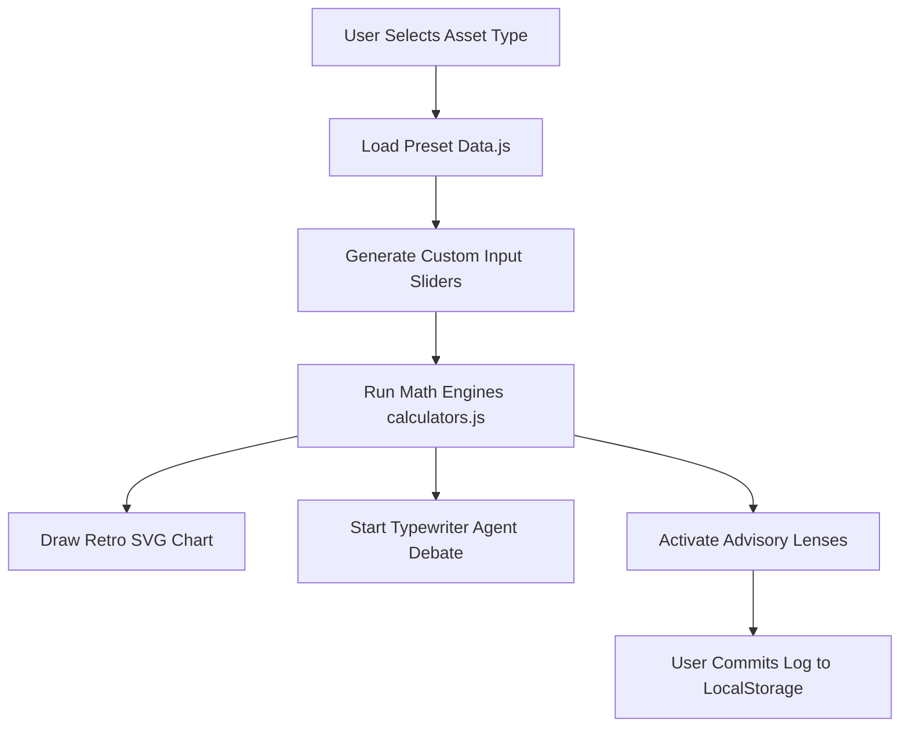

# Walkthrough: AI PM Portfolio & Investment Cockpit

Kita telah berhasil menyelesaikan seluruh rencana pembangunan **AI PM Portfolio Web App (Opsi A)** dengan estetika **Industrial & Grunge Cockpit**. Aplikasi ini siap dijalankan secara lokal tanpa dependensi tambahan.

---

## 📂 Ringkasan File Terbuat

Seluruh kode ditempatkan di subfolder `/web` agar rapi dan terisolasi:

1.  **[web/index.html](file:///d:/jp-invest/web/index.html)**: Kerangka layout modular, tag SEO, sidebar PM Case Study (untuk HR/Recruiter), panel parameter, layar osciloscope retro, split log debat agen, dan Advisory board switcher.
2.  **[web/style.css](file:///d:/jp-invest/web/style.css)**: Sistem desain visual bertema industrial (grid blueprint, lampu LED berkedip, hazard stripes, border tebal, serta tombol switch 3D mekanis).
3.  **[web/calculators.js](file:///d:/jp-invest/web/calculators.js)**: Porting logic kuantitatif finance (DCF, NPV, BEP, IRR, LTV, CAC, Black-Scholes, beserta format rupiah).
4.  **[web/data.js](file:///d:/jp-invest/web/data.js)**: Preset data fundamental, log percakapan debat agen otonom, dan rekomendasi Lensa Advisory.
5.  **[web/app.js](file:///d:/jp-invest/web/app.js)**: Logic controller utama (penghubung data, trigger simulasi debat typewriter, custom SVG chart drawer, dan LocalStorage logger).
6.  **[web/README.md](file:///d:/jp-invest/web/README.md)**: Dokumentasi panduan operasional dan deployment.

---

## ⚡ Fitur Utama & Visualisasi Dashboard

### 1. Retro Blueprint Grid & Mechanical Switches
*   Latar belakang menggunakan pola grid biru-hitam (*blueprint layout*) dengan pendaran neon halus.
*   Tombol selector vertical `[01] Stocks`, `[02] Startup`, dan `[03] Conventional` memiliki bayangan 3D solid yang tertekan ke dalam saat diklik, memberikan respons fisik mekanikal layaknya tombol instrumen fisik.



### 2. Live Quantitative Osciloscope Chart (SVG)
*   **Stocks**: Menampilkan grafik perbandingan arus kas tahunan (Nominal vs Discounted) dengan warna neon cyan.
*   **Startups**: Menampilkan kurva penurunan cash balance bulanan (*Runway burn-down roadmap*) lengkap dengan garis putus-putus titik kritis kehabisan uang (*Cash-out month*).
*   **Conventional**: Menampilkan persilangan kurva Break-Even Point (BEP) antara Total Pendapatan (Hijau) dan Total Biaya (Merah). Titik perpotongan ditandai dengan dot caution yellow dan bayangan transparan area untung/rugi.

### 3. Agentic Red Team Typewriter Log
*   Panel split-screen memisahkan argumen optimis (**▲ BULL**) dan pesimis (**▼ BEAR**).
*   Teks mengalir dengan efek ketikan mesin tik (*typewriter animation*) bergantian secara dinamis setiap kali preset diubah atau tombol `RE-RUN DEBATE` ditekan.

### 4. Local Ledger Auditor (Human-in-the-Loop)
*   User dapat memilih keputusan (*Approve / Hold / Reject*) dan mengetik justifikasi investasinya.
*   Saat diklik **Commit to Local Ledger**, data langsung dimasukkan ke `LocalStorage` browser dan di-render di tabel riwayat di bawahnya (berwarna hijau untuk Approve, kuning untuk Hold, merah untuk Reject). Riwayat ini tetap tersimpan meskipun halaman di-refresh.

---

## 🛠️ Langkah Pengujian Lokal (Manual Verification)

Guna memverifikasi hasil pengerjaan, ikuti petunjuk berikut di terminal komputer Anda:

1.  Masuk ke subfolder `web/`:
    ```bash
    cd web
    ```
2.  Jalankan server lokal bawaan Python:
    ```bash
    python -m http.server 8000
    ```
3.  Buka browser Chrome/Edge di alamat: [http://localhost:8000](http://localhost:8000).
4.  Coba interaksi berikut:
    *   Klik tab **METRICS & PRD** di sidebar kiri.
    *   Ubah vertical ke **STARTUP / VC METRICS** atau **CONVENTIONAL BIZ**.
    *   Geser salah satu slider di panel **Parameter Input Sandbox** dan perhatikan kurva grafik SVG di tengah langsung bergeser secara real-time.
    *   Isi form **Commit Human Decision Log** di kanan bawah lalu klik tombol hitam tebalnya untuk menguji LocalStorage ledger.
